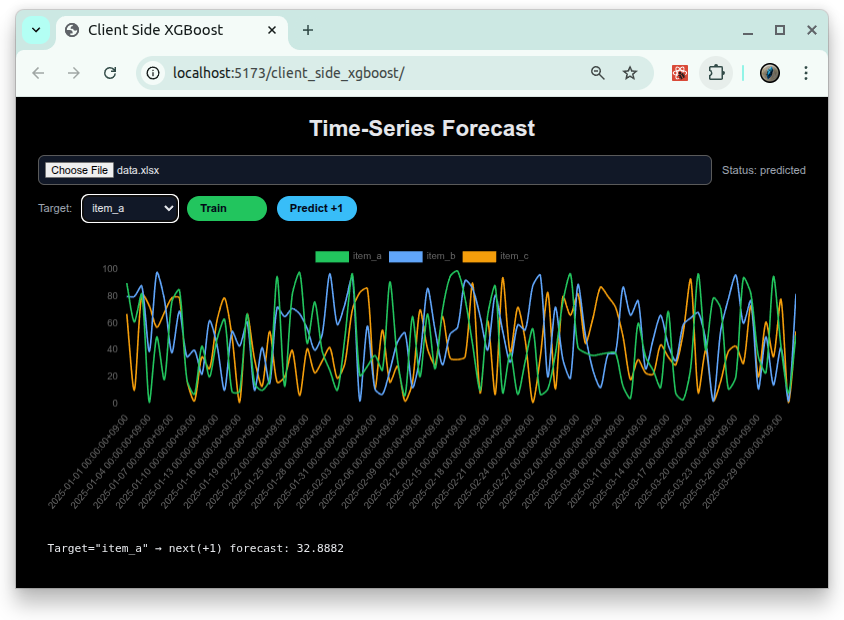

# [Client Side XGBoost](https://github.com/europanite/client_side_xgboost "Client Side XGBoost")

[](https://github.com/europanite/client_side_xgboost/actions/workflows/pages.yml)

Client Side Browser-Based XGBoost Time-Series Prediction. 



---

##  🚀 PlayGround
 [Client Side XGBoost](https://europanite.github.io/client_side_xgboost/)

---

## Data Structure

<pre>
datetime,item_a,item_b,item_c,...
2025-01-01 00:00:00+09:00,10,20,31,...
2025-01-02 00:00:00+09:00,12,19,31,...
2025-01-03 00:00:00+09:00,14,18,33,...
 ...
</pre>

---

**Development Environment**
- **Vite**: [Vite](https://vite.dev/) 
- **Container**: [Docker Compose](https://docs.docker.com/compose/) for consistent development setup

---

## 🚀 Getting Started

### 1. Prerequisites
- [Docker Compose](https://docs.docker.com/compose/)

### 2. Build and start all services:

```bash

# Build the image
docker compose build

# Run the container
docker compose up
```

---